# 포팅 매뉴얼

## 순서

1. 서버에 설정하기
2. 서버에 이미지 올리기
3. 깃에 올라가지 않는 파일들
4. 기술 스택과 버전 정리
5. 시연 시나리오

## 서버에 설정하기

EC2 서버를 사용하지 않더라도 우분투 서버를 사용하면 똑같이 할 수 있다.

서버에 따로 설치해야할 프로그램들

- Docker
- Nginx
- Openvidu

일단 처음으로 도커를 설치해야 한다.

### 도커 설치

1. 업데이트를 하고 https 인증에 필요한 패키지를 다운

```Shell
sudo apt-get update
sudo apt-get install ca-certificates curl gnupg
```

2. 도커의 오피셜 GPG키를 받는다

```Shell
sudo install -m 0755 -d /etc/apt/keyrings
curl -fsSL https://download.docker.com/linux/ubuntu/gpg | sudo gpg --dearmor -o /etc/apt/keyrings/docker.gpg
sudo chmod a+r /etc/apt/keyrings/docker.gpg
```

3. repository를 확인한다

```Shell
echo \
  "deb [arch="$(dpkg --print-architecture)" signed-by=/etc/apt/keyrings/docker.gpg] https://download.docker.com/linux/ubuntu \
  "$(. /etc/os-release && echo "$VERSION_CODENAME")" stable" | \
  sudo tee /etc/apt/sources.list.d/docker.list > /dev/null
```

4. docker 다운!

```Shell
sudo apt-get install docker-ce docker-ce-cli containerd.io docker-buildx-plugin docker-compose-plugin
```

5. 기본 예제 돌려보기

```Shell
sudo docker run hello-world
```

기본 예제가 잘 돌아간다면 도커 설치 완료

매번 sudo를 쳐야하는 것이 귀찮다면 [여기로](https://velog.io/@jeong3320/dockerdocker-sudo%EA%B6%8C%ED%95%9C%EC%97%86%EC%9D%B4-%EC%8B%A4%ED%96%89%ED%95%98%EA%B8%B0)

### Nginx 설치

1. Nginx 설치

```Shell
sudo apt install nginx
```

2. Nginx 상태 확인

```Shell
sudo systemctl status nginx
```

3. Nginx 실행 시작 / 중지

```Shell
sudo systemctl start nginx # 실행
sudo systemctl stop nginx # 중지
```

4. Nginx 환경 설정

```Shell
sudo vim /etc/nginx/sites-available/{파일명}.conf
```

conf 파일 말고 default에 작성해도 무관하다.
certbot이 어느정도 자동으로 작성해주기 때문에 인증 후에 작성하는 것이 좋다.

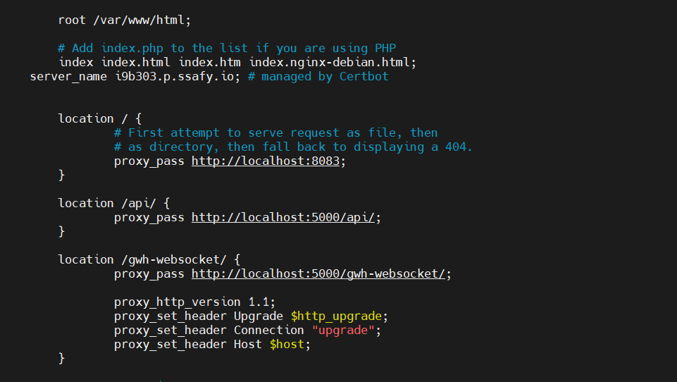

수정한 부분은 location 부분이다.

/ 로 요청한다면 프론트엔드가 올려져 있는 도커 컨테이너의 주소로 가게 하고

/api/ 로 요청한다면 백엔드가 올려져 있는 도커 컨테이너의 주소로 가게 했다.

/gwh-websocket/ (웹소켓 엔드포인트) 로 요청한다면 웹소켓 연결을 위한 주소로 가게 했다.
웹소켓은 proxy_pass 아래에 있는 줄도 필수!

### SSL 인증

1. letsencrypt 설치

```Shell
sudo apt-get install letsencrypt
```

2. Certbot 설치

```Shell
sudo apt-get install certbot python3-certbot-nginx
```

3. Certbot 동작

```Shell
sudo certbot --nginx
```

- 이메일 입력 - 이 이메일을 Openvidu에 적어줘야 한다.
- 약관 동의 - Y
- 이메일 발송 동의 - Y or N
- 도메인 입력 - 서버 주소 입력

이미 인증서가 있다면 그대로 사용할 지 선택할 수 있다.

congratulation 뭐시기가 뜨면 인증서 발급 완료다.

netstat이 설치되어 있지 않다면 설치하고

`netstat -napl` 을 통해 80포트와 443포트가 사용되고 있는지 확인하고 nginx를 중지했을 때 80포트와 443포트가 사용되지 않는지 확인한다.

### Openvidu 설치

Openvidu On premises 버전은 docker-compose를 통해 도커 컨테이너로 서버가 올라가는데

Openvidu Server, Kurento Media Server, Coturn, Redis, Nginx, App 으로 이루어져 있다.

App은 사실상 필요 없는 부분이고 Redis도 따로 설정해주지 않으면 올라가지

않기 때문에 Openvidu를 실행하고 docker ps를 하면 4개의 컨테이너가 올라가 있는것을 볼 수 있다.

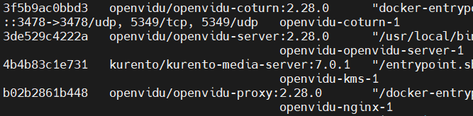

Openvidu는 https를 무조건 사용해야 하기 때문에 인증을 받아야 한다.

### 중요!

공식 문서를 보면 죄다 영어라 눈에 띄지 않아서 지나칠 수 있지만

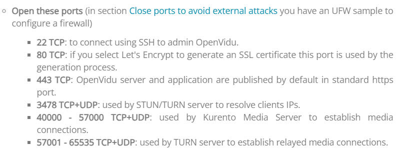

여기에 해당하는 포트를 모두 열어줘야 한다.

```Shell
ufw allow ssh
ufw allow 80/tcp
ufw allow 443/tcp
ufw allow 3478/tcp
ufw allow 3478/udp
ufw allow 40000:57000/tcp
ufw allow 40000:57000/udp
ufw allow 57001:65535/tcp
ufw allow 57001:65535/udp
ufw enable
```

이미 SSL인증을 받았으니 설치를 하자.

1. root 권한을 얻는다.

```Shell
sudo su
```

2. opt 폴더로 이동 후 Openvidu 설치

```Shell
cd /opt

curl https://s3-eu-west-1.amazonaws.com/aws.openvidu.io/install_openvidu_latest.sh | bash
```

설치가 잘 되었다면 이런 화면이 나오게 된다.

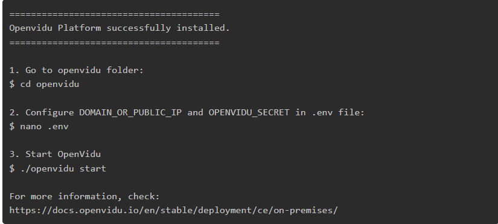

3. .env 파일을 수정해 환경설정

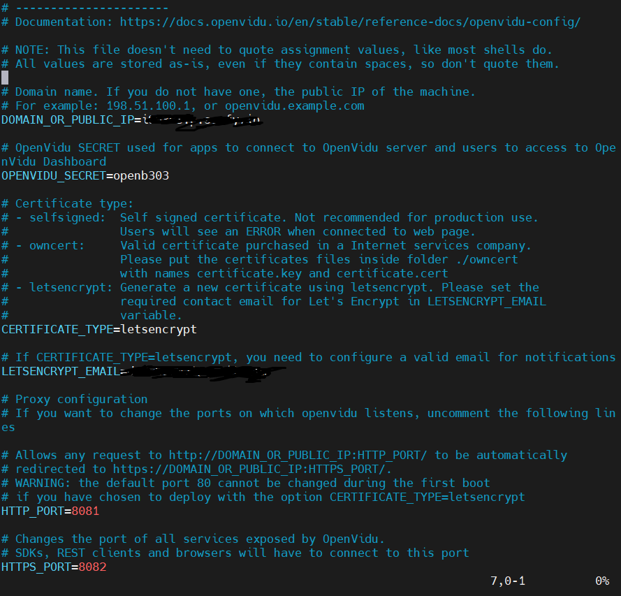

- DOMAIN_OR_PUBLIC_IP : 사용하는 도메인 주소
- OPENVIDU_SECRET : 프로젝트에서 사용할 비밀번호
- CERTIFICATE_TYPE : 사용할 인증서 타입. 우리 프로젝트에서는 letsencrypt를 사용한다.
- LETSENCRYPT_EMAIL : 인증서를 발급한 이메일 주소
- HTTP_PORT : Openvidu 안에서 사용할 http 포트
- HTTPS_PORT : Openvidu 안에서 사용할 https 포트. 이 포트가 Openvidu 서버와 연결을 할 수 있는 포트.

위의 두 포트 모두 사용하지 않는 포트를 사용해야 한다.

하지만 인증을 받으려면 먼저 80포트와 443포트에서 받아야 하기 때문에 처음에는 포트를 수정하지 않고 실행 후 잘 실행이 된다면
openvidu 중지 후 변경하면 된다.

4. Openvidu 서버 실행

```Shell
cd /opt/openvidu # 오픈비두가 설치된 폴더 안에서

./openvidu start # 서버 실행
./openvidu stop # 서버 중지
```

실행이 잘 된다면 이렇게 나온다.

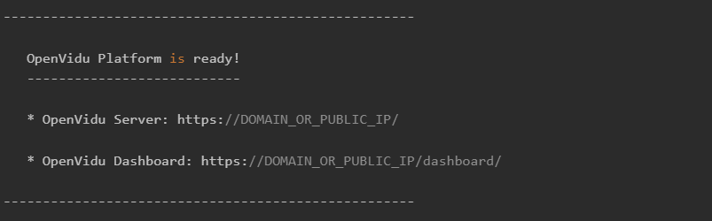

`https://DOMAIN_OR_PUBLIC_IP:HTTPS_PORT/`


이것과 비슷한 call app이 실행된다면 서버 실행 성공

openvidu rest api를 사용할 때 위의 주소를 사용해서 서버와 연결하면 된다.

서버에 배포할 때에는 openvidu call app이 필요없기 때문에

openvidu가 설치된 폴더에서

`rm docker-compose.override.yml` 로 call app을 삭제할 수 있다.

이렇게 다 된다면 일단 서버에서 설정할 것은 다 설정했다.

## 서버에 이미지 올리기

배포 순서

Dockerfile 작성 → 프로젝트 빌드 → 이미지 빌드 → Docker hub에 푸시

→ EC2에서 풀 → 컨테이너 실행

### Dockerfile 작성

프론트, 백 각각의 프로젝트의 최상단에 작성

프론트

```Dockerfile
# base image 설정(as build 로 완료된 파일을 밑에서 사용할 수 있다.)
FROM node:14-alpine as build

# 컨테이너 내부 작업 디렉토리 설정
WORKDIR /app

# app dependencies
# 컨테이너 내부로 package.json 파일들을 복사
COPY package*.json ./

# package.json 및 package-lock.json 파일에 명시된 의존성 패키지들을 설치
RUN npm install

# 호스트 머신의 현재 디렉토리 파일들을 컨테이너 내부로 전부 복사
COPY . .

# npm build
RUN npm run build

# prod environment
FROM nginx

# 이전 빌드 단계에서 빌드한 결과물을 /usr/share/nginx/html 으로 복사한다.
COPY --from=build /app/build /usr/share/nginx/html

# 기본 nginx 설정 파일을 삭제한다. (custom 설정과 충돌 방지)
RUN rm /etc/nginx/conf.d/default.conf

# custom 설정파일을 컨테이너 내부로 복사한다.
COPY nginx.conf /etc/nginx/conf.d

# 컨테이너의 8083번 포트를 열어준다.
EXPOSE 8083

# nginx 서버를 실행하고 백그라운드로 동작하도록 한다.
CMD ["nginx", "-g", "daemon off;"]
```

간단히 설명하자면
노드 버전은 node:14-alpine 버전을 사용했다.
서버에 올리기 위한 간소화된 버전이라고 할 수 있다.
그리고 프론트엔드는 8083포트를 열어주었다.

nginx.conf

```
server {
    listen 8083;

    location / {
        root   /usr/share/nginx/html;
        index  index.html index.htm;
        try_files $uri $uri/ /index.html;
    }

}
```

백

```Dockerfile
FROM openjdk:11-jdk-slim
ARG JAR_FILE=build/libs/GaeWoonHae-0.0.1-SNAPSHOT.jar
COPY ${JAR_FILE} app.jar
EXPOSE 5000
ENTRYPOINT ["java", "-jar", "/app.jar"]
```

백도 11버전 slim 버전을 사용했고 5000포트를 열어주었다.

### 프로젝트 빌드

프론트에서 빌드하는 방법
프론트에서 빌드 방법

- `npm i` 로 패키지 다운로드
- `npm run build`로 빌드
- `docker build -t <태그> .` 으로 이미지 생성
- `docker push <태그>` 로 푸시
- EC2에서 `docker pull <태그>` 로 풀
- EC2에서 run

백에서 빌드 방법

- gradle 탭에서 clean
- gradle 탭에서 build
- 프론트와 같음

업데이트를 하지 않고 돌려보기만 할거라면 빌드는 필요없다.

### 서버에 올리기

이미 빌드가 된 이미지가 docker hub에 존재하기 때문에 이미지만 받아서 실행한다면 서버에 바로 올릴 수 있다.

위의 EC2 설정을 완료했다면 docker에 Mysql을 받는다.

`docker run -d -p 3306:3306 --name mysql -e MYSQL_ROOT_PASSWORD="password" mysql:8.0.33` 을 작성하면 mysql을 동작시킬 수 있다.

도커에 올린 후 mysql workbench를 사용해서 도메인과 설정한 비밀번호를 사용한다면 workbench에서도 서버의 테이블을 확인할 수 있다.

도커 내에서 mysql을 확인하고 싶다면

`docker exec -it mysql bash` 를 작성하면 bash가 실행되고

`mysql -u root -p` 를 작성하고 비밀번호를 입력하면 mysql을 사용할 수 있다.

프론트

`docker run --rm -d -p 8083:8083 --name gwh-client mantarayyy/gaewoonhae:client-0.1
`

백

`docker run --rm -d -p 5000:5000 --name gwh-server mantarayyy/gaewoonhae:server-0.1
`

이후 `docker ps`를 입력했을 때

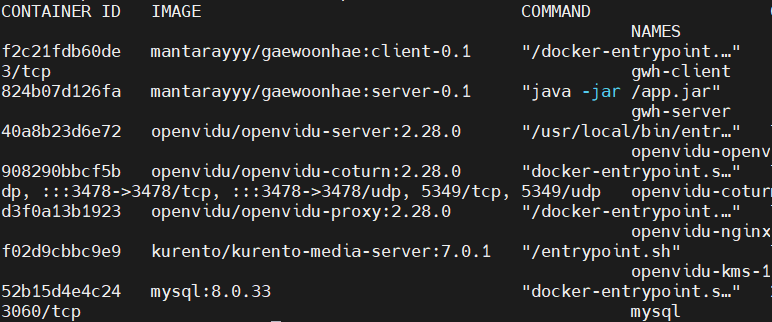

이렇게 나온다면 성공이고 잘 실행되는지 확인하면 끝!

## 깃에 올라가지 않는 파일들

.env

```
REACT_APP_KAKAO_JS_KEY=<실제 키>
REACT_APP_KAKAO_REDIRECT_URI=https://i9b303.p.ssafy.io/login/kakao/callback
REACT_APP_SPRING_URI=https://i9b303.p.ssafy.io
REACT_APP_CLIENT_URI=https://i9b303.p.ssafy.io
```

application.yaml

```yaml
server:
  port: 5000

server.ssl.enabled: false
OPENVIDU_URL: https://i9b303.p.ssafy.io:8082/
OPENVIDU_SECRET:

spring:
  profiles:
    active: prod

springdoc:
  packages-to-scan: com.threeracha.gaewoonhae.api
  default-consumes-media-type: application/json;charset=UTF-8
  default-produces-media-type: application/json;charset=UTF-8
  swagger-ui:
    path: /
    disable-swagger-default-url: true
    display-request-duration: true
    operations-sorter: alpha
```

application-prod.yaml

```yaml
spring:
  datasource:
    driver-class-name: com.mysql.cj.jdbc.Driver
    url: jdbc:mysql://i9b303.p.ssafy.io:3306/GWHDB?serverTimezone=Asia/Seoul
    username: b303
    password:
  jpa:
    hibernate:
      ddl-auto: create
    properties:
      hibernate:
        format_sql: true
    show-sql: true
    defer-datasource-initialization: true
  sql:
    init:
      mode: always

jwt:
  secret-key:

oauth:
  kakao:
    client-id:
    url:
      auth: https://kauth.kakao.com
      api: https://kapi.kakao.com
  naver:
    secret:
    client-id:
    url:
      auth: https://nid.naver.com
      api: https://openapi.naver.com
```

application-local.yaml

```yaml
spring:
  datasource:
    driver-class-name: com.mysql.cj.jdbc.Driver
    url: jdbc:mysql://localhost:3306/GWHDB?serverTimezone=Asia/Seoul
    username: ssafy
    password: ssafy

  jpa:
    hibernate:
      ddl-auto: create
    properties:
      hibernate:
        format_sql: true
    show-sql: true
    defer-datasource-initialization: true
  sql:
    init:
      mode: always

jwt:
  secret-key:

oauth:
  kakao:
    client-id:
    url:
      auth: https://kauth.kakao.com
      api: https://kapi.kakao.com
  naver:
    secret:
    client-id:
    url:
      auth: https://nid.naver.com
      api: https://openapi.naver.com

logging:
  level:
    org:
      hibernate:
        SQL: debug
        type: trace
```

## 기술 스택과 버전 정리

jdk : 도커 - openjdk:11-jdk-slim, 개발 - Azul Zulu version 11.0.19
node : 도커 - node:14-alpine 개발 - 14.21.3
mysql : 8.0.33
spring : 2.7.1

외부 API : 카카오 로그인 REST API

## 시연 시나리오

1. 랜딩 페이지
   

   카카오 로그인 버튼을 누른다.
2. 로그인
   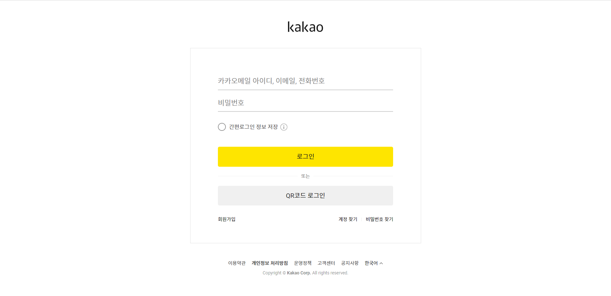

3. 메인 페이지
   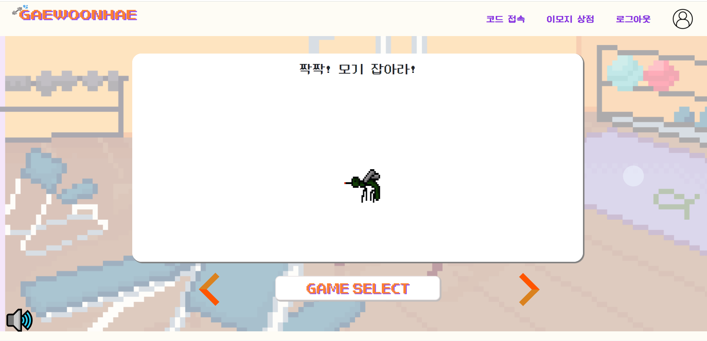

   메인 페이지의 우측 상단에 있는 이모지 상점을 누른다.
4. 이모지 상점
   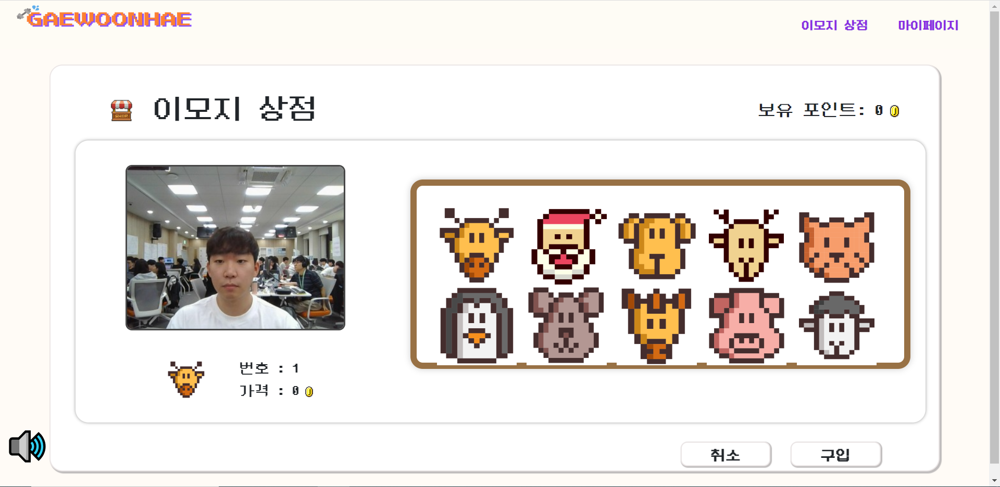

   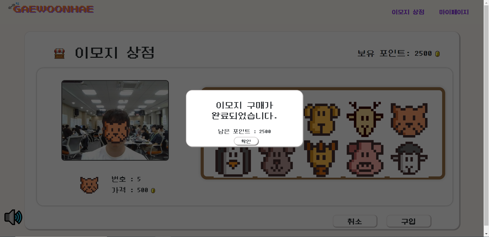

   이모지 상점에서 이모지 2개 구입한다.
5. 마이 페이지
   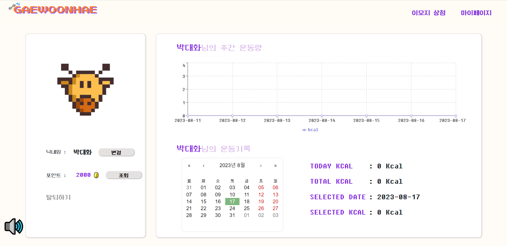

   마이페이지에서 이모지를 누르면 이모지 변경 모달이 나온다.
   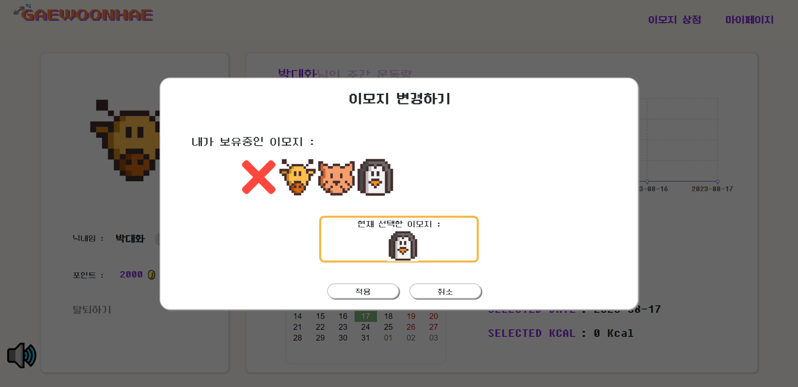

   사용할 이모지를 선택하고 적용을 누른다.
   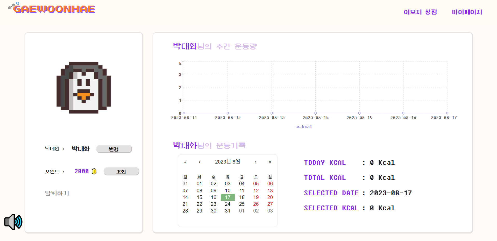

   선택한 이모지가 맞는지 확인
6. 모기 잡기 게임 선택
   

   방 생성 버튼을 누른다.
7. 로비
   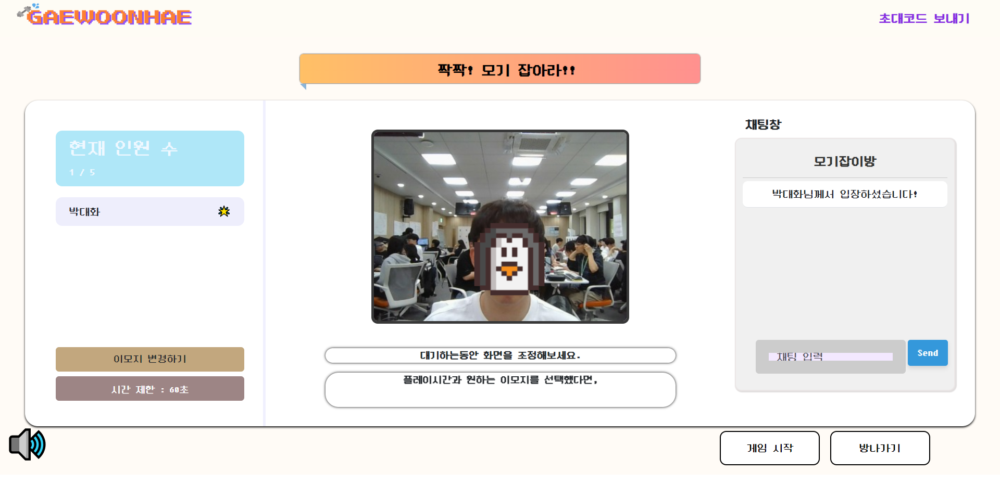

   우측 하단의 게임 시작 버튼을 누른다.
8. 게임 진행
   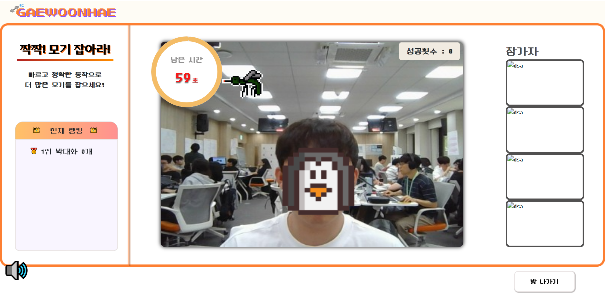

9. 초대 코드로 접속
   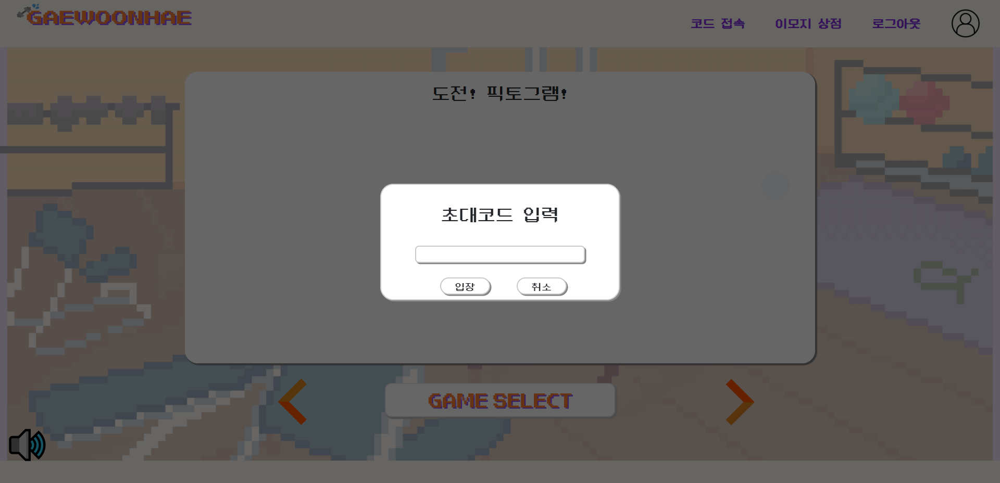

   픽토그램 방으로 이동
10. 게임 결과
    

    게임 결과를 확인하고 나가기 버튼을 누름
11. 운동량 변경 확인
    
    
