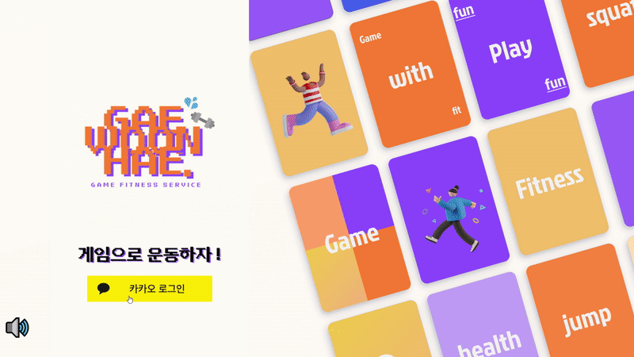
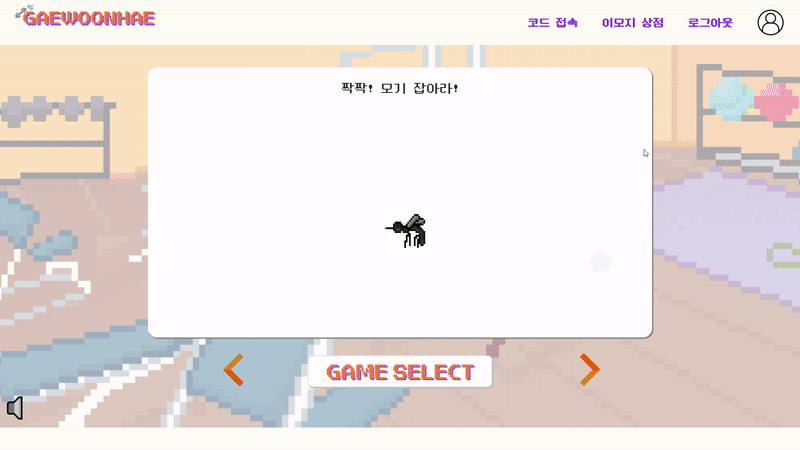
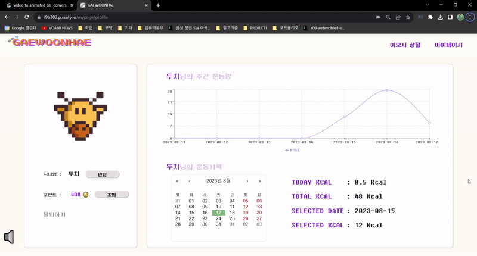
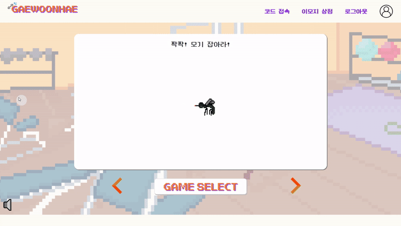
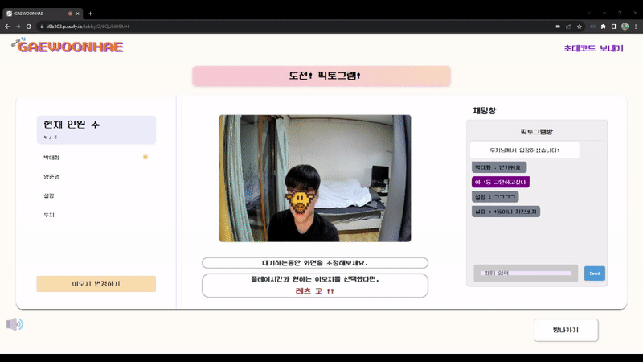
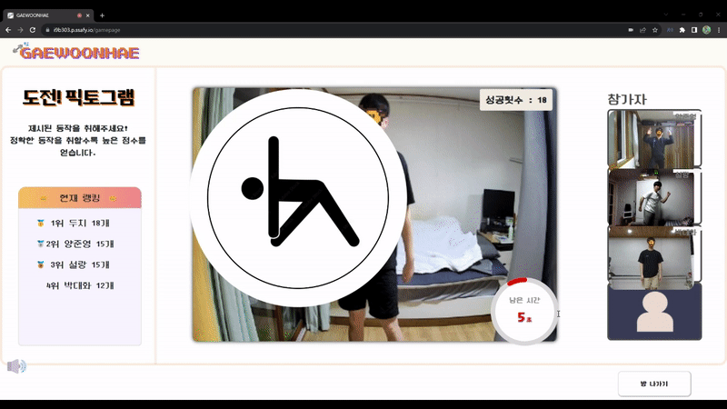
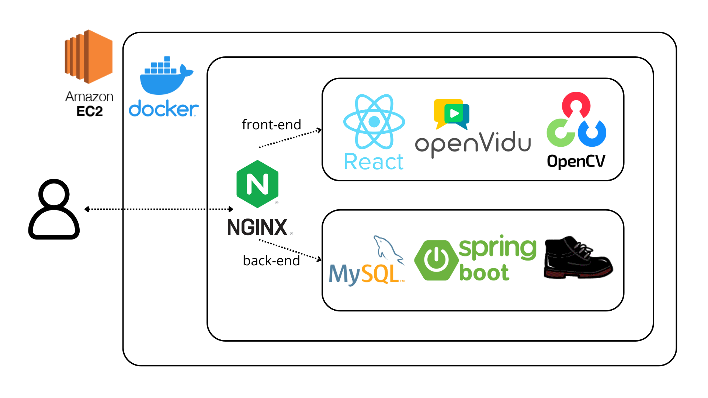
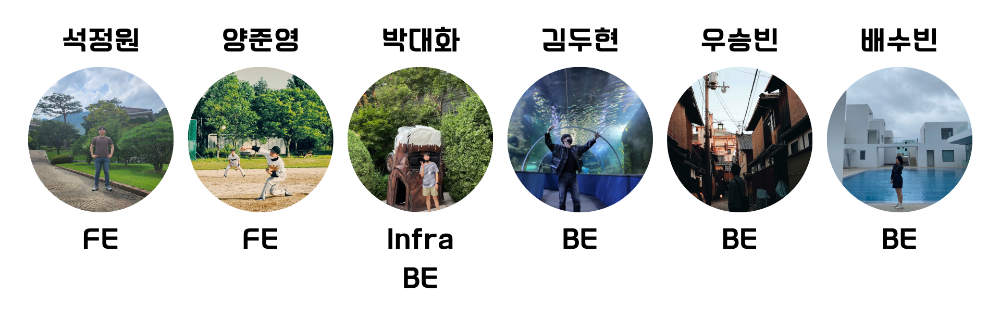

# 🎮 + 🤸‍♀️ = 개운해(Web-RTC 기반 바디 레크리에이션 플랫폼)


## 🌟 서비스 개요


[GWH UCC 클릭](https://youtube/Wdtb7Ek3Li4)

# 놀면서 운동하는 가면 놀이터
- 게임으로 운동해, 개운해는 운동에 진입장벽을 느끼는 현대인들에게 재밌고 뿌듯한 액티비티를 제공합니다 !


## 💡 주요 특징

- WebRTC 기반 비디오 공유 서비스
- WebSocket을 이용한 실시간 게임 정보 통신, 채팅
- OpenCV를 이용한 얼굴 이모지 처리
- Teachable machine을 이용한 자세 판별
- 활동기록 조회 및 보상 시스템


## 🖥️ 서비스 화면


- 로그인



- 이모지상점



- 마이페이지



- 대기방 생성



- 게임방 입장



- 게임 진행(모기 잡아라)


- 게임 진행(픽토그램)


- 결과페이지




## 🏘️시스템 아키텍쳐



## 📡 기술 스택
- [STOMP 웹 소켓 프로토콜](../readme/websocket.md)
- [OpenCV.js 이미지 처리](../readme/opencv.md)
- [Teachable Machine 모션 캡쳐](../readme/teachablemachine.md)


## 🛠️ 개발 환경


- BackEnd
```
    IntelliJ
    Java 11
    Spring boot 2.7.1
    Gradle
    JPA hibernate
    Spring Security
    Stomp-websocket 2.3.3
    Mysql
```
    

- FrontEnd
    
```
    Visual Studio Code
    Bootstrap 5.3.1
    redux-toolkit 1.1.2
    styled-component 2.8.0
    SockJS 1.6.1
```
    
- CI/CD
    
```
    AWS ec2
    Nginx
    Docker 24.0.04
```
    
- Convergence Technology
    
```
    ⚙ Teachable Machine 0.8.3
    OpenVIdu 2.28.0
    OpenCV 4.8.0
```

## 🤝 팀소개


## 📋 산출물
- [기능정의서](../readme/result/기능정의서.md)
- [ERD](../readme/result/erd.md)
- [시스템 다이어그램](../readme/result/diagram.md)
- [API 명세서](../readme/result/api.md)

## 📋 팀스페이스

상세 개발과정 및 후일담은 아래에 정리되어있습니다!

🚀[개운해 팀스페이스](https://www.notion.so/e803aff4b5e941beaae98885e5b8dbc4?pvs=21)🚀
